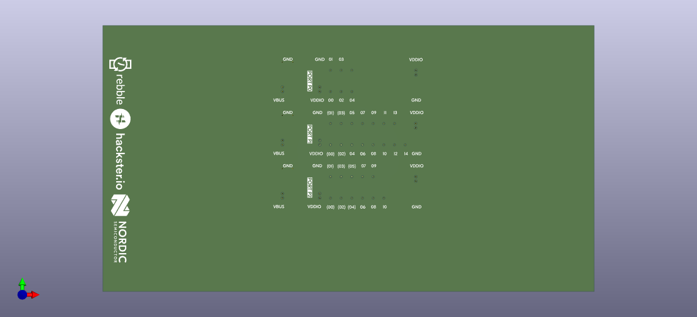
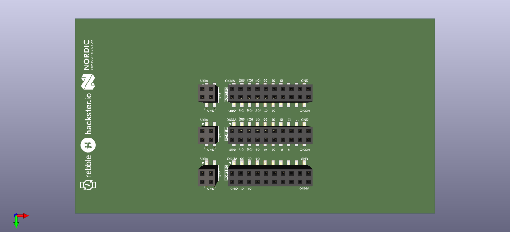

# nRF54L15-DK Rebble Shield - SMD

---
KiCAD PCB template with Bottom SMD header connection to nRF54L15-DK.  
Intended to support Rebble contestants on [Hackster.io](https://Hackster.io)

  
  

This KiCAD Template simplifies initial setup for creating an nRF54L15-DK Shield PCB designs. 
To begin, clone this repository to your KICAD_USER_TEMPLATE_DIR as found under "Preferences > Configure Paths..." 
Next, use "File > New Project from Template..." or "Ctrl+T" and select "User Templates." Select the template and begin!
